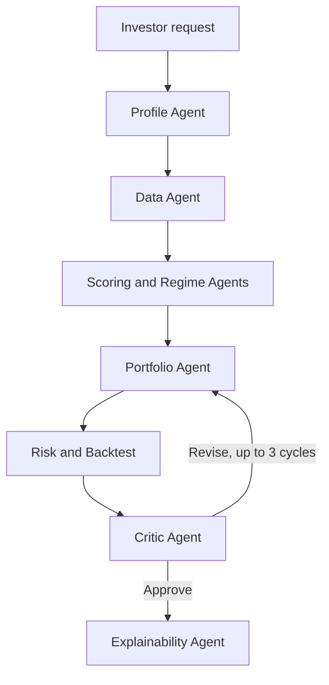

# Multi-Agent Investment Research System

A research-oriented decision-support system that coordinates specialized AI agents to analyze U.S. equities, construct a portfolio, evaluate risk, and explain the resulting recommendation.

This repository contains my bachelor's thesis project. It combines LLM-based reasoning with machine learning, quantitative portfolio optimization, retrieval-augmented memory, and explicit policy constraints. It is an engineering and research prototype—not a proven investment strategy or financial advice.

## Architecture



The system uses two LangGraph workflows: one for portfolio construction and another for ongoing portfolio monitoring. Shared graph state carries profiles, market data, model outputs, risk reports, provenance, and execution traces between agents.

## Specialized agents

- **Profile Agent** — converts a natural-language request into a structured investor profile.
- **Data Agent** — collects market, fundamental, macroeconomic, and news data.
- **Scoring Agent** — combines ML predictions with technical and fundamental signals.
- **Regime Agent** — classifies the current market environment.
- **Portfolio Agent** — selects assets and calculates portfolio weights.
- **Risk Agent** — evaluates volatility, drawdown, VaR, concentration, and policy constraints.
- **Critic Agent** — reviews the proposal and can trigger another construction cycle.
- **Explainability Agent** — produces a structured, human-readable rationale.
- **Monitoring Agent** — evaluates an existing portfolio and recommends whether action is required.

## Engineering highlights

- LangGraph orchestration with conditional routing and up to three critic-driven revision cycles.
- A 100-asset universe with asset-class, sector, geography, and style metadata.
- XGBoost scoring based on technical and macroeconomic features.
- Portfolio optimization with PyPortfolioOpt and Ledoit-Wolf covariance estimation.
- Three retrieval mechanisms for investment knowledge, cached news, and previous decisions.
- FastAPI endpoints and a Streamlit interface for portfolio construction and monitoring.
- Request IDs, correlation IDs, provenance records, decision logs, and persistent execution traces.
- 58 unit and integration tests covering agents, graphs, API handlers, RAG, policies, risk, and UI helpers.

## Technology stack

Python, LangGraph, LangChain, OpenAI, Pydantic, XGBoost, scikit-learn, PyPortfolioOpt, ChromaDB, Hugging Face embeddings, yfinance, FastAPI, Streamlit, Pandas, and NumPy.

## Running locally

```bash
git clone https://github.com/Gregory-mcbit/diploma.git
cd diploma

python -m venv .venv
source .venv/bin/activate  # Windows: .venv\Scripts\activate
pip install -r requirements.txt
```

Create a `.env` file:

```env
OPENAI_API_KEY=your_openai_api_key
```

Initialize the default knowledge base:

```bash
python -m app.rag.init_knowledge
```

Start the API:

```bash
uvicorn app.api.app:app --reload
```

Or launch the Streamlit interface:

```bash
streamlit run app/ui/streamlit_app.py
```

Run the test suite:

```bash
pytest
```

## Disclaimer

This project is for research and educational purposes only. It does not provide financial advice or a recommendation to buy or sell securities.
